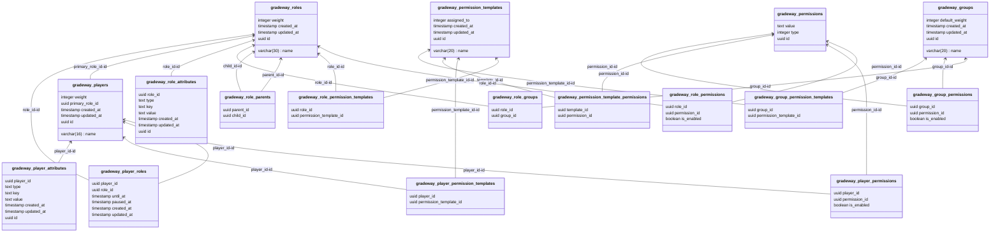

# Database Schema

```mermaid
classDiagram
direction BT
class gradeway_group_permission_templates {
   uuid group_id
   uuid permission_template_id
}
class gradeway_group_permissions {
   uuid group_id
   uuid permission_id
   boolean is_enabled
}
class gradeway_groups {
   varchar(20) name
   integer default_weight
   timestamp created_at
   timestamp updated_at
   uuid id
}
class gradeway_permission_template_permissions {
   uuid template_id
   uuid permission_id
}
class gradeway_permission_templates {
   varchar(20) name
   integer assigned_to
   timestamp created_at
   timestamp updated_at
   uuid id
}
class gradeway_permissions {
   text value
   integer type
   uuid id
}
class gradeway_player_attributes {
   uuid player_id
   text type
   text key
   text value
   timestamp created_at
   timestamp updated_at
   uuid id
}
class gradeway_player_permission_templates {
   uuid player_id
   uuid permission_template_id
}
class gradeway_player_permissions {
   uuid player_id
   uuid permission_id
   boolean is_enabled
}
class gradeway_player_roles {
   uuid player_id
   uuid role_id
   timestamp until_at
   timestamp paused_at
   timestamp created_at
   timestamp updated_at
}
class gradeway_players {
   varchar(16) name
   integer weight
   uuid primary_role_id
   timestamp created_at
   timestamp updated_at
   uuid id
}
class gradeway_role_attributes {
   uuid role_id
   text type
   text key
   text value
   timestamp created_at
   timestamp updated_at
   uuid id
}
class gradeway_role_groups {
   uuid role_id
   uuid group_id
}
class gradeway_role_parents {
   uuid parent_id
   uuid child_id
}
class gradeway_role_permission_templates {
   uuid role_id
   uuid permission_template_id
}
class gradeway_role_permissions {
   uuid role_id
   uuid permission_id
   boolean is_enabled
}
class gradeway_roles {
   varchar(30) name
   integer weight
   timestamp created_at
   timestamp updated_at
   uuid id
}

gradeway_group_permission_templates  -->  gradeway_groups : group_id-id
gradeway_group_permission_templates  -->  gradeway_permission_templates : permission_template_id-id
gradeway_group_permissions  -->  gradeway_groups : group_id-id
gradeway_group_permissions  -->  gradeway_permissions : permission_id-id
gradeway_permission_template_permissions  -->  gradeway_permission_templates : template_id-id
gradeway_permission_template_permissions  -->  gradeway_permissions : permission_id-id
gradeway_player_attributes  -->  gradeway_players : player_id-id
gradeway_player_permission_templates  -->  gradeway_permission_templates : permission_template_id-id
gradeway_player_permission_templates  -->  gradeway_players : player_id-id
gradeway_player_permissions  -->  gradeway_permissions : permission_id-id
gradeway_player_permissions  -->  gradeway_players : player_id-id
gradeway_player_roles  -->  gradeway_players : player_id-id
gradeway_player_roles  -->  gradeway_roles : role_id-id
gradeway_players  -->  gradeway_roles : primary_role_id-id
gradeway_role_attributes  -->  gradeway_roles : role_id-id
gradeway_role_groups  -->  gradeway_groups : group_id-id
gradeway_role_groups  -->  gradeway_roles : role_id-id
gradeway_role_parents  -->  gradeway_roles : child_id-id
gradeway_role_parents  -->  gradeway_roles : parent_id-id
gradeway_role_permission_templates  -->  gradeway_permission_templates : permission_template_id-id
gradeway_role_permission_templates  -->  gradeway_roles : role_id-id
gradeway_role_permissions  -->  gradeway_permissions : permission_id-id
gradeway_role_permissions  -->  gradeway_roles : role_id-id
```
